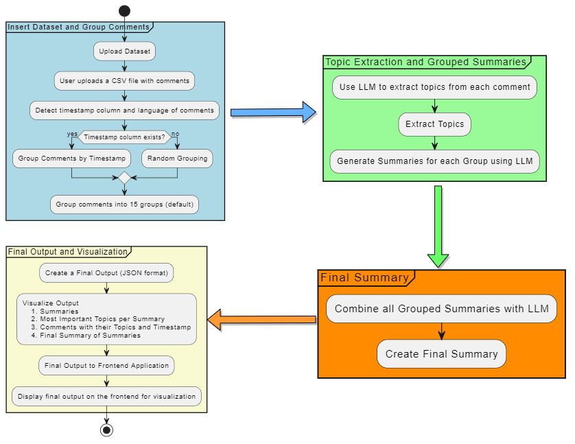

# LLM-Based Summarization and Topic Modeling Application

## Repository Link
The full code for this project is available on GitHub: [LLM Research Topic Modeling](https://github.com/Rafimc13/LLM_Research_Topic_Modelling)

## Project Overview
This application leverages Large Language Models (LLMs) for summarizing and extracting topics from large datasets of user comments or reviews. The main features include:
- Grouping comments by timestamp or randomly (if no timestamp exists)
- Extracting topics from each comment
- Generating summaries for each group of comments
- Creating a final overarching summary

The application also visualizes these summaries and topics, providing users with an organized overview of the main discussion points within the dataset.

## How to Start the Application

Follow these steps to get the application up and running:

1. **Install the required Python packages:**
   ```bash
   pip install -r requirements.txt
   ``` 
2. **Navigate to the frontend directory:**
   ```bash
   cd summary_app/frontend
   ```
3. **Install Node.js (if it is not already installed on your computer).**
   
4. **Build the frontend assets:**
   ```bash
   npm run build
   ```
5. **Run the application:**
   ```bash
   python -m summary_app.app.py
   ```
   
## Application Workflow

### UML Diagram
The following UML diagram illustrates the overall workflow of the application:



### Brief Workflow Description

#### 1. Insert Dataset and Group Comments
- **User Input**: Users upload a CSV file containing comments.
- **Processing**: The app detects timestamps (if available) and identifies the language of the comments.
- **Grouping**: Comments are grouped by timestamp. If no timestamp exists, grouping is performed randomly.

#### 2. Topic Extraction and Summarization
- **Topic Extraction**: The application uses a Language Learning Model (LLM) to identify key topics from each comment.
- **Summarization**: For each group of comments, the application generates a summary.

#### 3. Final Summary Generation
- **Cohesive Summary**: All group summaries are combined into a single, cohesive final summary using the LLM.

#### 4. Output and Visualization
- **Output Format**: The results are generated in JSON format, containing:
  - Summaries
  - Key topics
  - Comments
  - Timestamps
- **Frontend Display**: The output is displayed on the frontend for easy visualization and exploration.

---

**Note**: This README file provides a structured overview, with each command formatted consistently for ease of understanding. 


